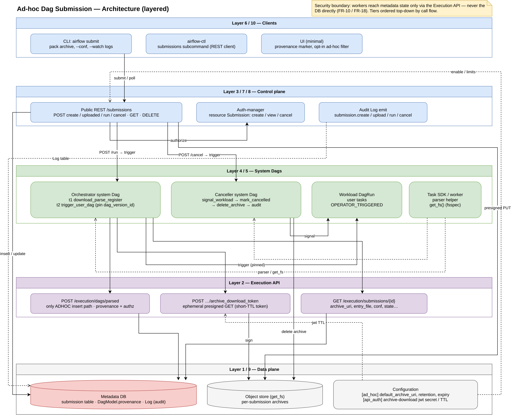
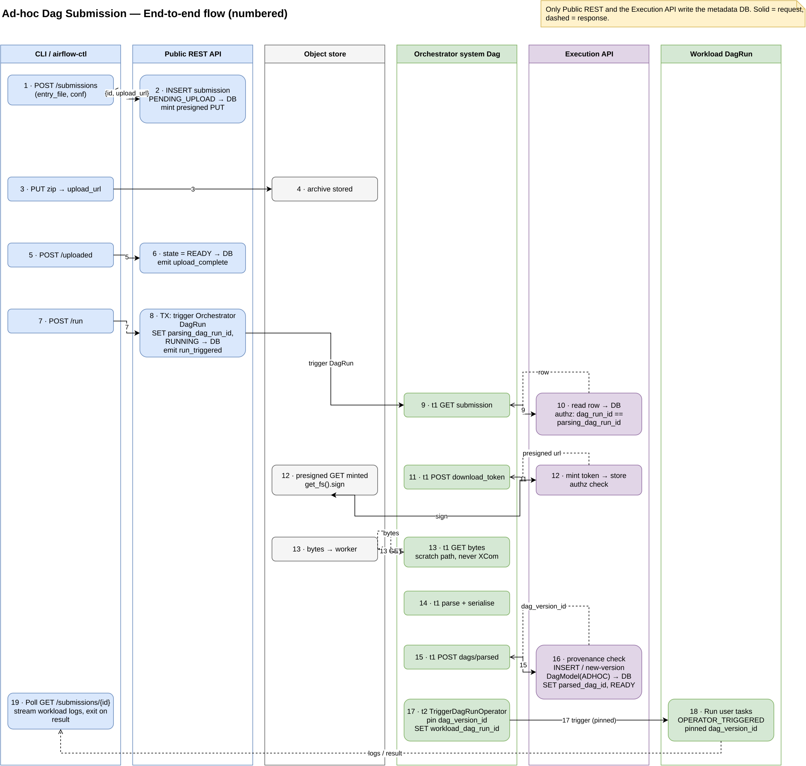

<!--
 Licensed to the Apache Software Foundation (ASF) under one
 or more contributor license agreements.  See the NOTICE file
 distributed with this work for additional information
 regarding copyright ownership.  The ASF licenses this file
 to you under the Apache License, Version 2.0 (the
 "License"); you may not use this file except in compliance
 with the License.  You may obtain a copy of the License at

   http://www.apache.org/licenses/LICENSE-2.0

 Unless required by applicable law or agreed to in writing,
 software distributed under the License is distributed on an
 "AS IS" BASIS, WITHOUT WARRANTIES OR CONDITIONS OF ANY
 KIND, either express or implied.  See the License for the
 specific language governing permissions and limitations
 under the License.
 -->

# AIP-XX: Ad-hoc Dag submission (`airflow submit`)

> Draft of an Airflow Improvement Proposal. The fields below mirror the
> Confluence AIP template; they will be transcribed into the wiki page
> when the proposal moves to discussion.

## Status

| Field | Value |
| --- | --- |
| State | Draft |
| Discussion Thread | _(to be filed on dev@airflow.apache.org)_ |
| Vote Thread | _(n/a until discussion closes)_ |
| Vote Result Thread | _(n/a)_ |
| Progress Tracking (PR / GitHub Project / Issue Label) | _(to be filed; suggested label: `AIP-XX`)_ |
| Date Created | 2026-05-06 |
| Version Released | _(target: a future Airflow 3.x minor)_ |
| Authors | Jason Liu (@jason810496) |

## Motivation

Airflow today is optimised for Dags that live in a bundle (Git, local
filesystem, custom `BaseDagBundle`) and are parsed by the Dag file
processor before any run can be created. That model fits production
scheduling well, but it does not fit a class of workflows that show up
repeatedly in ML and data-science work:

- A user has a pipeline checked out on their laptop and wants to run it
  once on a remote cluster for testing, experimentation, or any other
  kind of ad-hoc execution (typically because the cluster has GPUs,
  more memory, or access to data the laptop does not).
- The pipeline is hard-coupled to cloud infrastructure: it needs
  credentials and services that only exist in the cluster (Kubernetes
  secrets, Vault, and similar), so it cannot be exercised end-to-end on
  the laptop at all. Submitting it to the cluster is the only way to
  validate the real path.
- They want a tight feedback loop: edit locally, submit, watch logs,
  iterate. "Commit, push, wait for bundle refresh, trigger, watch" is
  too slow for experimentation, and the per-iteration wait is the most
  common complaint about the current development cycle.
- They expect a `spark-submit`-style command. Submit a script and its
  dependencies, get a run, get logs, get an exit status. `ray job
  submit`, `flyte run`, SkyPilot, and Slurm all expose this shape;
  Airflow does not.

Existing primitives do not cover this:

- `airflow dags test` runs the Dag **locally**, in-process with the
  CLI. It does not exercise the remote workers, scheduler, or executor.
- `airflow dags trigger` requires the Dag to already exist in a bundle
  and be parsed; it cannot ship a file from the local machine.
- `BaseDagBundle` is designed around named, versioned, refreshable
  sources. Treating every ad-hoc submission as a new bundle pollutes
  the bundle namespace and forces the Dag processor to track ephemeral
  state it should not own.

This AIP introduces a first-class **ad-hoc Dag submission** path so a
user can package a Dag file (with optional supporting modules) on their
laptop, submit it to the API server, and have a worker download, parse,
and execute it as a one-shot run.

The design principles that follow from this motivation — workers never
touching the metadata DB, the submission row as the single source of
truth, per-DagRun authorization, never persisting the
download credential, provenance separation, Dag-version pinning, and
reuse of existing Airflow primitives — are summarised below.


## Considerations

The proposal touches three architectural surfaces and needs them to
land together to be useful end-to-end.

1. **Dag provenance on `DagModel`.** A new marker (`BUNDLE` vs `ADHOC`)
   so ad-hoc submissions are distinguishable from bundle-parsed Dags
   and cannot shadow them. The marker is mandatory; the exact column
   placement (on `DagModel` directly or on a sibling table) is
   deferred.
2. **A new Execution API endpoint** that accepts a serialised parse
   result from a worker. This is the **only** path by which an ad-hoc
   Dag enters the metadata DB; workers do not import DB-bound models.
   Authentication piggybacks on the existing per-task-instance JWT.
3. **A built-in "system Dag"** that orchestrates the
   download → parse → register → trigger sequence. The CLI does not
   talk to a bespoke dispatcher; it triggers the system Dag with the
   submission as parameters. This means retries, logs, observability,
   and the UI all work for free.

Special considerations and known difficulties:

- **Two DagRuns per submission** (system Dag + user Dag). This is more
  observable surface to explain to users and document in the UI.
- **Local dependency discovery is best-effort.** The CLI uses Python's
  `ast` plus `importlib.util.find_spec` to walk imports of the entry
  file. Runtime-only imports (`__import__(name)`, `importlib` by
  string) will be missed; users must be able to add files explicitly.
- **Object-store access is a hard dependency** for ad-hoc execution.
  Object storage is the only supported archive backend; there is no
  local-filesystem fallback and the API server does not proxy archive
  bytes. Deployments without a configured object store cannot use
  the feature.
- **Inter-user `dag_id` collisions** among ad-hoc submissions are
  intentionally **not** technically guarded. Naming hygiene is treated
  as a governance question; the Execution API surfaces collisions
  clearly so deployments can apply their own policy.
- **Trust model is unchanged** versus bundle-backed Dags: submitted
  code runs on the worker with the worker's identity. The new attack
  surface is "submit a malicious Dag via the public API", so
  authentication and per-user quotas are mandatory at GA, not optional.

## What change do you propose to make?

Add a `spark-submit`-style ad-hoc Dag submission path to Airflow:

- A new `airflow submit <entry_file> [--conf <json>]
  [--watch / --no-watch]` CLI in the Task SDK / CLI, with the same
  operations exposed via airflow-ctl as REST clients.
- A new `Submission` data model in core that owns the archive and run
  lifecycle and is linked to a transient ad-hoc `DagModel` (with
  provenance marker `ADHOC`) and the resulting `DagRun`.
- A new public REST surface under
  `airflow-core/src/airflow/api_fastapi/core_api/routes/public/submissions.py`
  for create / upload / run / status / list / cancel.
- A new Execution API endpoint that accepts a serialised parsed Dag
  from a worker, enforces provenance rules, and persists it.
- A built-in system Dag that downloads the archive (via `get_fs()`),
  parses and registers it via the Execution API endpoint, and triggers
  the user's Dag via `TriggerDagRunOperator`.
- A provenance marker (`BUNDLE` / `ADHOC`) on `DagModel` so ad-hoc
  rows are distinguishable from bundle-parsed rows and cannot shadow
  them.

The user Dag run is created by `TriggerDagRunOperator` from the system
Dag, so it is `DagRunType.OPERATOR_TRIGGERED`. **No new `DagRunType` is
introduced**; the provenance column is what distinguishes ad-hoc Dags.

### CLI surface (`airflow submit`)

`airflow submit` follows the `spark-submit` shape — name an entry point,
ship the local code, pass parameters, pick the compute target, and
choose whether to wait:

```text
airflow submit <entry_file>

  # local code to ship
  --project-dir <dir>     root to discover and pack local imports from
                          (default: the entry file's directory)
  --include <path>        extra file or directory to add to the archive; repeatable
                          (runtime imports or data files the static walker misses)
  --exclude <glob>        path to omit from the archive; repeatable

  # parameters
  --conf <json>           JSON string forwarded to the user Dag run's conf
                          (same flag as `airflow dags trigger`)

  # target & identity
  --queue <name>          executor queue to dispatch the workload to
  --run-id <id>           run id for the workload Dag run (as in `airflow dags trigger`)

  # lifecycle
  --watch / --no-watch    stream the workload's logs and exit on its result (default: --watch)
  --timeout <duration>    stop watching after this long (does not cancel the run)
```

Two concerns are deliberately *not* flags, because Airflow already owns
them: the target API server comes from the existing CLI / airflow-ctl
configuration (like `ray job submit`'s `RAY_ADDRESS`, not a `--server`
flag); and compute resources plus third-party dependencies stay in the
Dag (operator arguments, `executor_config`, pools) and the worker image,
so the only compute knob is `--queue` rather than a replicated `--gpus`
/ `--cpus`.

### How the system Dags are shipped and registered

The orchestrator and canceller "system Dags" are not generated at
runtime and are not a bespoke dispatcher — they are ordinary,
pre-written Dag files that ship inside the Airflow core distribution,
for example:

```text
.../site-packages/airflow/system_dags/ad_hoc_dag_submission.py
```

A deployment turns them on exactly as it turns on its own Dags: by
registering one **additional Dag bundle** that points at that packaged
directory. With the built-in `LocalDagBundle`, the `[dag_processor]
dag_bundle_config_list` entry is:

```ini
[dag_processor]
dag_bundle_config_list = [
    {
      "name": "airflow-system-dags",
      "classpath": "airflow.dag_processing.bundles.local.LocalDagBundle",
      "kwargs": {"path": "/usr/local/lib/python3.12/site-packages/airflow/system_dags"}
    }
  ]
```

The Dag file processor then parses these files like any other bundle,
and `airflow submit` triggers them by `dag_id`. Retries, logs, the
task-log endpoint, and the UI all come from the existing DagRun
machinery; nothing about the orchestration is special to the worker.
The exact packaged location is a packaging decision still being
finalised, so the path above is illustrative.

### Architecture

The feature is layered so that workers reach metadata state only
through the Execution API, never the database directly — the same
boundary bundle-parsed Dags already respect. Clients (the `airflow
submit` CLI, airflow-ctl, the UI) talk to the public REST surface; the
public REST surface and the Execution API are the only writers to the
metadata DB; the orchestrator and canceller system Dags run on workers
and reach the database only through the Execution API; archives live in
the object store and are never proxied through Airflow.



### End-to-end flow

A single `airflow submit` produces **two DagRuns**: the *orchestrator*
system Dag that downloads, parses, registers, and triggers; and the
*workload* DagRun that runs the user's tasks. The numbered sequence:

- **1.** CLI → public REST `POST /submissions` with the entry file and
  the run `conf`.
- **2.** Public REST inserts the submission row (`PENDING_UPLOAD`),
  mints a presigned `PUT`, and returns `{id, upload_url}`.
- **3.** CLI uploads the packed archive with the presigned `PUT`,
  direct to object storage.
- **4.** Object store holds the archive.
- **5.** CLI → `POST /uploaded` signals that the upload is complete.
- **6.** Public REST moves the row to `READY` and emits an
  `upload_complete` audit event.
- **7.** CLI → `POST /run`.
- **8.** Public REST, in one transaction, triggers the orchestrator
  DagRun, records `parsing_dag_run_id` on the row, moves the row to
  `RUNNING`, and emits `run_triggered`. `submission_id` is the **only**
  value carried in the orchestrator's `conf`; every other field is read
  back from the row.
- **9-10.** Orchestrator task 1 → Execution API `GET submission`. The
  Execution API reads the row and authorizes the caller by checking
  `dag_run_id == parsing_dag_run_id`, so a forged `submission_id` is
  useless.
- **11-13.** Orchestrator task 1 requests a short-TTL archive-download
  token; the Execution API mints a presigned `GET` via `get_fs()`; the
  task streams the bytes to a scratch path (never onto XCom).
- **14.** Orchestrator task 1 parses the entry file and serialises the
  resulting Dag.
- **15-16.** Orchestrator task 1 → Execution API `POST /dags/parsed`.
  The Execution API runs the provenance check (rejecting any `BUNDLE`
  collision), inserts or versions the `ADHOC` `DagModel`, records
  `parsed_dag_id`, and returns the `dag_version_id`. This is the
  **only** path by which an ad-hoc Dag enters the metadata DB.
- **17.** Orchestrator task 2 triggers the workload DagRun with
  `TriggerDagRunOperator`, pinning the exact `dag_version_id` and
  recording `workload_dag_run_id`.
- **18.** Workload DagRun runs the user's tasks
  (`DagRunType.OPERATOR_TRIGGERED`) against the pinned version.
- **19.** CLI polls `GET /submissions/{id}`, streams the workload's
  task logs, and exits on the final result.



## What problem does it solve?

It closes the gap between "I have a pipeline on my laptop" and "I want
to run it on the cluster, now, once." Today users either:

- Commit, push, wait for a bundle refresh, then trigger — a feedback
  loop measured in minutes that is hostile to ML iteration where most
  attempts are throwaway.
- Run `airflow dags test` locally — which does not use the cluster's
  workers, executors, or resources, so it cannot validate behaviour on
  the system the user actually wants to use.
- Reach for a different tool (Ray, SkyPilot, Slurm) for ad-hoc remote
  execution and use Airflow only for the scheduled side. The
  orchestration layer ends up split across two systems.

## Why is it needed?

The use case has been raised explicitly by users (e.g. on the SkyPilot
Slack) who want Airflow to host the orchestration layer of an ML
pipeline but keep the development loop local. The shape they expect is
the `spark-submit` shape; offering it natively means Airflow can serve
both the scheduled production workflow and the ad-hoc experimentation
workflow with the same mental model, the same CLI, the same UI, and
the same observability.

The mechanism is also useful well beyond ML: any team that runs short,
parameterised, one-off jobs against a remote cluster benefits from the
same workflow.

## Are there any downsides to this change?

- **New public surface to maintain**: REST endpoints, CLI commands, a
  data model, archive lifecycle, retention policy, UI surface.
- **The orchestration runs as an ordinary Dag, not a new worker code
  path.** Downloading the archive, parsing it, and registering the
  result are tasks in a system Dag that ships with Airflow; the worker
  runs them exactly as it runs any other task, with no special "ad-hoc"
  branch in the worker runtime. The cost is that failure modes (corrupt
  archive, missing entry file, import errors at parse time) must surface
  as a failed orchestrator task with a useful stack trace through the
  standard task-log endpoint, not a stuck task.
- **Object-store access becomes a hard dependency** for ad-hoc
  execution in any non-trivial deployment.
- **New abuse vector**: a way for any authenticated user to run code
  on a worker via the public API. Authentication, RBAC, and per-user
  quotas are mandatory at GA.
- **Two DagRuns per submission** (system Dag + user Dag) is more
  observable surface to explain.
- **Drift risk**: the system Dag runs paths it does not own (parse +
  serialise). It must be versioned with Airflow and tested against
  changes to `SerializedDAG` and the Execution API.
- **Inter-user `dag_id` collisions** among ad-hoc submissions are not
  guarded by core; deployments must establish a governance model.

## Which users are affected by the change?

- **Dag Authors / ML & data-science engineers**: gain a new submission
  workflow. No change required to existing Dags; the feature is purely
  additive.
- **Deployment Managers**: gain a new feature to enable, configure
  (object-store backend, archive retention, quotas), and govern
  (naming convention for ad-hoc `dag_id`s).
- **Platform / Security teams**: must review the new public surface
  for their auth and RBAC posture before enabling it; need to set
  quotas and a naming convention.

Bundle-backed Dags and their authors are **not** affected: provenance
ensures ad-hoc submissions can never shadow bundle Dags.

## How are users affected by the change? (e.g. DB upgrade required)

- **DB upgrade required**: a new `Submission` table, a provenance
  marker on `DagModel` (column or sibling table), and an FK from the
  ad-hoc `DagRun` back to the `Submission`. Standard Alembic migration
  applies.
- **No change required to existing Dags.** Bundle-parsed Dags continue
  to behave identically; default queries filter ad-hoc rows out.
- **New CLI subcommand** (`airflow submit ...`) and matching
  airflow-ctl commands. Discoverable via `--help`.
- **New REST surface** under `/submissions`. Existing endpoints are
  unchanged.
- **UI surface** gets a "Submissions" tab in a follow-up; until then
  ad-hoc runs appear in the existing Dag / DagRun views, distinguished
  by the provenance marker.

## What is the level of migration effort (manual and automated) needed for the users to adapt to the breaking changes?

**No breaking changes for existing users.** The proposal is purely
additive:

- Existing Dags continue to parse and run unchanged. They are still
  `BUNDLE` provenance and have no relationship to the new
  `Submission` model.
- Existing `airflow dags test`, `airflow dags trigger`, and
  `airflow dags backfill` are unchanged in semantics. The new path is
  a separate verb (`airflow submit`).
- The DB migration is automated via Alembic. No Dag-author-side
  changes are required.
- Default query filters exclude `ADHOC`-provenance rows from listings
  that today implicitly expect bundle Dags, so dashboards and metrics
  built on those queries see no change in shape.

For Airflow 3 specifically, the new path is built **on** Airflow 3
boundaries (workers talk only to the API server, including for Dag
registration). It does not extend the documented "DFP / Triggerer
direct-DB access" limitation; it deliberately routes through the
Execution API.

A migration utility is **not** required, since no existing Dags need
to change.

## Other considerations?

- **Variables, connections, and RBAC.** Default proposal: ad-hoc runs
  see the same variable / connection set as bundle-backed Dags, gated
  by the user's RBAC. Revisit if abuse is observed.
- **Multi-team scoping.** Submissions need to be scoped to a team's
  executor queues and connections in multi-team deployments. Likely
  "team is a column on `Submission`, inherited from the user's team",
  but this needs confirmation with the multi-team owners.
- **Quotas and lifecycle.** Default retention for archives, default
  per-user submission quotas, default expiration of `PENDING_UPLOAD`
  rows that never receive an upload. Will be addressed in a follow-up
  design doc.
- **Single-node and offline deployments.** Not supported. Object
  storage is the only archive backend; deployments without one
  cannot use ad-hoc submission. `breeze` and other local setups must
  point at a configured object-store URI (e.g. a local MinIO) to
  exercise the feature.
- **Logs and reproducibility.** If the archive is deleted but logs are
  kept, reproducing a failure later requires the user to keep the
  source. Documented; offer an optional "keep archive on success /
  failure / both" knob.

## Implementation stages

The work lands in four stages. Stages 1-3 together constitute GA and map
onto the "done" criteria below; Stage 4 is the explicit follow-up
bucket. The backend spine (Stage 1) and the user-facing surface
(Stage 2) are split so they can proceed as parallel PR tracks once the
schema is agreed, but Stage 1 must merge first — nothing in Stage 2 is
useful without it.

**Stage 1 — Backend spine.** The architectural core from
[Considerations](#considerations); these pieces are only useful
together and land as one milestone.

- `Submission` model and Alembic migration, including the `DagModel`
  `BUNDLE`/`ADHOC` provenance marker, the foreign keys, and the indexes.
- Provenance enforcement at registration: reject any ad-hoc `dag_id`
  that already has a `BUNDLE` row, and return a structured indicator for
  ad-hoc-vs-ad-hoc collisions.
- Execution API: the parsed-Dag registration endpoint and the short-TTL
  archive-download token endpoint, both authorised by the
  `submission.parsing_dag_run_id == caller's dag_run_id` check.
- Orchestrator system Dag (download → parse → register → trigger),
  shipped in core and exposed via the system-Dags bundle.
- Object-store archive transport via `get_fs()`, and the atomic
  trigger-and-link of the submission row to its parsing DagRun.

This is verifiable without any public surface: a test inserts a row,
uploads an archive, triggers the orchestrator, and asserts a `success`
user DagRun. Covers done-criteria 2, 3, 4, 5.

**Stage 2 — User-facing submission surface.** Turns the spine into the
`spark-submit`-style command.

- Public REST: create / upload (presigned) / run / get / list, with the
  schemas and an OpenAPI refresh.
- `airflow submit <entry_file>` CLI: pack, presigned upload, trigger,
  `--conf`, `--watch / --no-watch`, and an explicit include for files
  the import walker misses.
- Local dependency discovery (`ast` + `importlib.util.find_spec`).
- airflow-ctl `submissions` subcommand as a REST client.
- Authenticated-only submissions and the per-user visibility default.

Covers done-criterion 1 and the CLI tests in 8.

**Stage 3 — Governance, lifecycle, and observability.** What makes the
feature safe to enable on a shared cluster; GA-blocking.

- Cancellation system Dag and the REST `cancel` entry point.
- Auth-manager `Submission` resource and its `create` / `view` /
  `cancel` actions.
- Audit-log entries for the submission lifecycle.
- Archive retention policy and `PENDING_UPLOAD` expiry configuration.
- Provenance marker surfaced in the existing Dag / DagRun UI views.
- User guide, Deployment-Manager guide, and the security-model entry.

Covers done-criteria 6 and 7.

**Stage 4 — Scale and UX (follow-ups, not blocking GA).** The items this
AIP lists as out of scope.

- A dedicated "Submissions" UI tab.
- Per-user submission quotas enforced at the API server.
- Multi-team scoping (a team column on `Submission`, with executor and
  queue scoping inherited from the user's team).
- A Python-callable submit form (`client.submit(fn, *args)`).

## What defines this AIP as "done"?

The AIP is "done" when all of the following are true:

1. **Functional end-to-end path** in Airflow core:
   - `airflow submit <entry_file>` packs and uploads an archive,
     triggers the system Dag, and streams logs from the resulting user
     DagRun until completion.
   - The same flow is reachable via the public REST API and via
     airflow-ctl.
2. **Provenance is enforced** at the Execution API endpoint:
   - Ad-hoc registration of a `dag_id` that already has a `BUNDLE` row
     is rejected.
   - Collisions between two ad-hoc submissions on the same `dag_id`
     return a clear, structured indicator that deployment-side
     governance can react to.
3. **Workers do not bypass the Execution API** to register ad-hoc
   Dags. Verified by tests that assert no direct ORM use from worker
   paths.
4. **The system Dag ships with Airflow** and is exercised by an
   integration test that covers the full
   download → parse → register → trigger flow against the real
   Execution API.
5. **Migration applied**: Alembic migration for the `Submission` table
   and the `DagModel` provenance marker is in `main`, with downgrade
   tested.
6. **Documentation in tree**:
   - User-facing "Submitting ad-hoc Dags" guide.
   - Deployment Manager guide covering object-store configuration,
     quotas, and the dag_id naming-convention recommendation.
   - Security model entry noting the new attack surface and the
     required mitigations (auth, quotas, RBAC).
7. **Default UI surface**: ad-hoc DagRuns are visible in the existing
   Dag / DagRun views with provenance distinguishable; a dedicated
   "Submissions" tab is a follow-up and not blocking.
8. **Tests**: unit and integration coverage for the Execution API
   endpoint (provenance rules, collision response shape), the system
   Dag (each task, end-to-end), the CLI (local dependency discovery,
   pack-and-upload), and the worker path (archive download,
   parse-error surfacing).
The AIP does **not** need to deliver, in the same release: a UI
"Submissions" tab, full multi-team scoping, per-user quotas at the
API-server level, or a Python-callable submit form (`client.submit(fn,
*args)`). Those are explicitly follow-ups.
